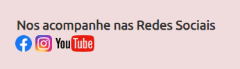
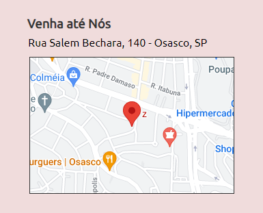
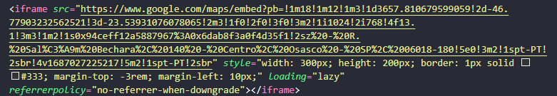
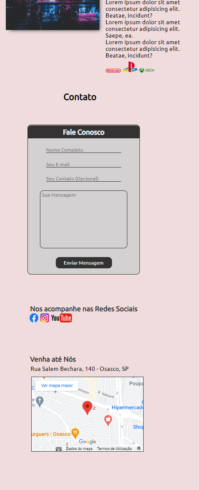
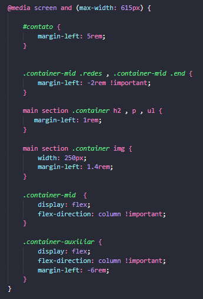

# MODULO 5 | EBAC GAME SHOP

#### Tecnologias 
HTML , CSS

Projeto seguindo os padrões demonstrados pelo tutor em aula (Layout e posicionamento) dos elementos.

Tomei a liberdade de colocar os href nas imagens de Redes Sociais

Além destas, coloquei um iframe do Google Maps na area de localização

Coloquei um media query no codigo CSS para ajustar os conteudos da section Contato

