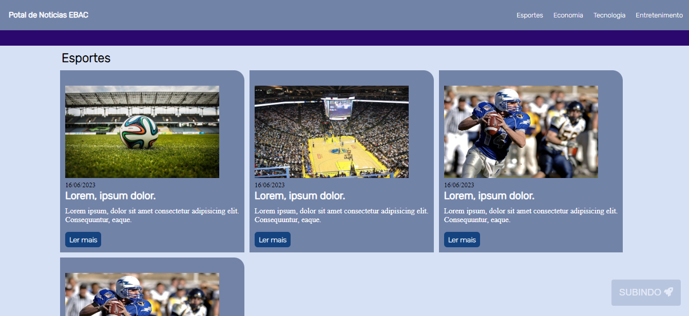
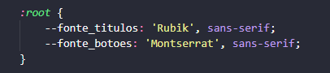

# PORTAL DE NOTICIAS EBAC

## TECH
Feito com HTML,CSS e JS

Usei Javascript para um botão de retorno ao topo devido ter notado que era muito ruim pro usuario subir toda a pagina 
quando chegasse ao fim dela.

Defini duas variaveis no CSS para fonte importadas do Google.

Escrito por Johnny Trucolo